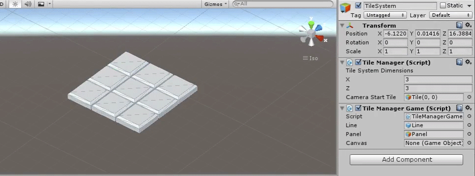
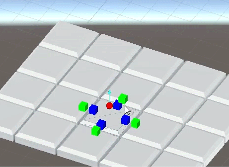
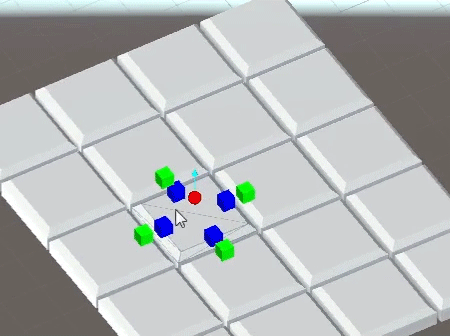

# StrategyTileSystem

A tile system created in Unity. I created it with the thought of strategy RPGs in mind. 

Each tile has its own connections and various other properties that can be used for movement, attacking, and other gameplay features.

 I implemented basic movement and attacking as an example of what could be done.

